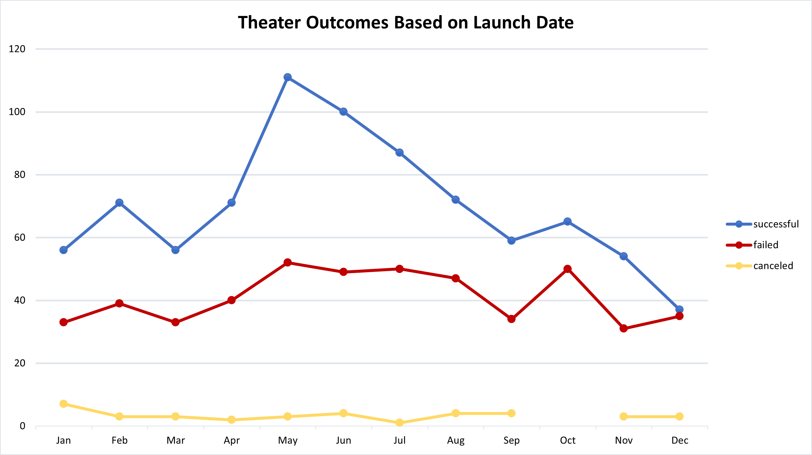
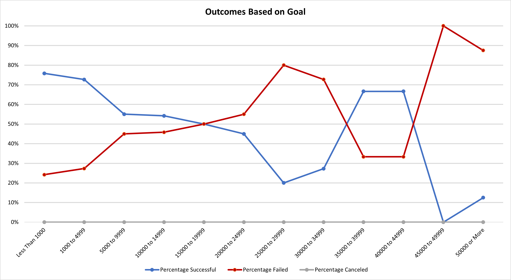

# Kickstarting with Excel

## Overview of Project

The purpose of this project was to help my friend, Louise, analyze data from Kickstarter to see if we could draw any conclusions about how best to set up the campaign for her play, *Fever*, for success. Questions of interest included *"do success rates for campaigns change with the date of their launch?"* and *"does the size of the goal influence the success rate for play campaigns?"*

## Analysis and Challenges

We worked this analysis in an Excel workbook. We started with a table containing columns describing the campaigns with their titles, goals, funding received, campaign category, and launch date, among others. Before answering any questions, we had to do a small amount of cleaning, converting the "deadline" and "launched_at" columns from timestamps into dates we could recognize, and separating the "category" column into two columns describing a parent category and a subcategory.

### Analysis of Outcomes Based on Launch Date

With that cleaned table ready to go we inserted a pivot table to start answering the question regarding campaign success rates vs their launch dates. In order to get a more reliable view we filtered the parent category to "theater", so we didn't have a lot of noise from campaigns that aren't similar to Louise's clouding our view. We also filtered out the "live" outcome to exclude campaigns that are still ongoing. This was all used to generate a line graph showing the total number of successful, failed, and canceled campaigns, grouped by the month they were launched. 

### Analysis of Outcomes Based on Goals

In order to get an idea of the success rates based on the size of the goal we made a table with varying goal sizes and used countifs to count the number of successful, failed, and canceled projects in the "plays" subcategory for each goal size. We made a category for "small" goals (less than $1,000), and split the rest into $5,000 increments, up to $50,000. The total number of projects in each category varied largely so we made "percentage" columns showing the percent of projects that succeeded, failed, or were canceled in that category so there was an even base of comparison across the board. With that work done we could post all the data together on a single line chart showing the goal sizes on the x-axis and the percentage of success/failure/cancelation on the y-axis.

### Challenges and Difficulties Encountered

While this specific analysis didn't have too many difficulties, a possible difficulty could exist in getting the data into spreadsheet form depending on how the data are delivered. If you try to bring these data into Excel and convert it to columns with spaces as the delimiter you could end up with data everywhere due to the names and blurbs having many words and spaces in them (depending on how the underlying file was generated). The same issue could be had if the data were originally imported as comma separated values. Thankfully this work was done for us before we got started on our analysis. An additional difficulty could be introduced by trying to convert all the currencies to equivalent USD amounts for even more precision in the goal category comparisons. Depending on how granular you wanted to get you would need to look up historical average conversion rates for the month or the year of the campaign being launched.

## Results

- What are two conclusions you can draw about the Outcomes based on Launch Date?

One conclusion we can draw here is that there is a seasonality to the success stories. It appears that theater campaigns launched in early summer (May & June) get funded more often. This appears to be because more campaigns overall are launched in these months than other months, but also if you look at the percentages of successes in each month, May and June still come out on top, with 67% and 65% success rates, respectively.

Another conclusion we can draw is to not launch your campaign near Christmas. There aren't many other launches happening in that time, but peoples' money is most likely tied up in other things that time of year, as can be seen by the simultaneous drop in successful campaigns and rise in failed campaigns in the month of December.

- What can you conclude about the Outcomes based on Goals?

A conclusion we can draw here is that you are increasing your risk of not being funded by asking for more money, with "50-50" odds occurring in the $15,000 to $19,999 category. 

Interestingly, there are two categories high up in the goal tiers that got funded more often than not ($35,000 to $39,999 and $40,000 to $45,000) - but I would look closer at those projects before deciding those are "good" tiers. If you filter down the dataset to goals between $35,000 and $45,000, you'll see that the average donation for successful campaigns is $218.26, whereas the average donation for successful play campaigns in all goal categories is $80.74. This would indicate to me that these big budget success stories either have institutional backers or are being networked to a much wealthier group of people than the average play campaign. So, unless Louise knows she has multiple whales in her network, I would advise trying to keep her campaign goal below $15,000.

- What are some limitations of this dataset?

There isn't any indication of how quickly the goals were achieved for the projects that did succeed. It would be helpful to know if there were some general amount of time where, if you didn't receive your funding by then, you weren't likely to succeed at all. If we had this information, we could advise Louise on how far out to set her deadline or when to ramp up her advertising push before that "no-go" date is reached.

- What are some other possible tables and/or graphs that we could create?

We could make the "Theater Outcomes Based on Launch Date" graph but filter it to the "plays" subcategory instead of just the "theater" parent category to see if plays have a different trend than theater campaigns as a whole. We could also use the "staff_pick" and "spotlight" columns to see if a campaign becoming a staff pick or being featured in the spotlight has a significant effect on the outcome. Depending on the answer there, we could recommend Louise either spend time figuring out how to get on those "featured" lists or ignore those altogether and focus on her own personal network for campaigning if it doesn't make much of a difference.
